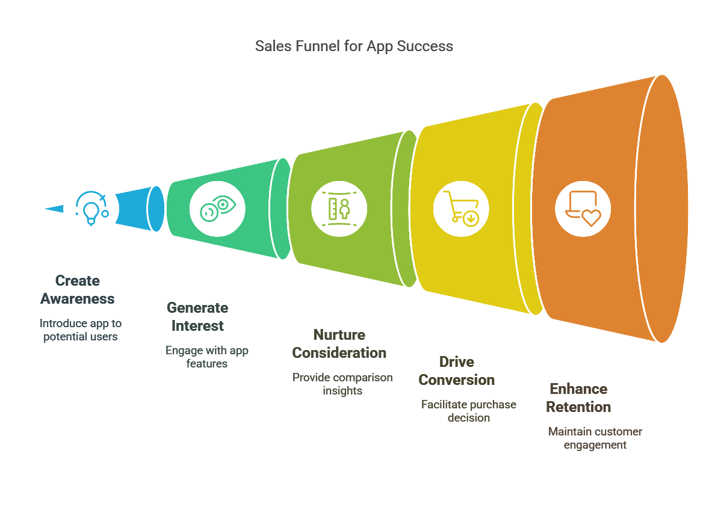

# Understanding the Sales Funnel in Digital Marketing: A Guide for Developers

## Hey there, fellow developers!

In the fast-paced world of digital marketing, selling a product, especially a software application, demands a well-thought-out strategy. And guess what? The sales funnel is your secret weapon to successfully market and sell your apps! In this article, we’ll dive into what a sales funnel is, how a programmer can use it to boost app sales, and explore some practical tips.

---

## What is a Sales Funnel?

A sales funnel is like a roadmap that guides potential customers from the moment they discover your product to the point where they make a purchase. It’s made up of several stages, each playing a crucial role in converting leads into paying customers. Let’s break it down:

1. **Awareness:** This is where you introduce your app to the world. It’s all about getting people to know about your product and why they should care.
2. **Interest:** Once people are aware of your app, they’ll start exploring its features and benefits. This is your chance to show them why your app is the best choice for them.
3. **Consideration:** Now, it’s time for potential customers to weigh their options and decide if your app is the right fit for them. This is where you can provide them with the information they need to make an informed decision.
4. **Conversion:** The final stage is where you turn leads into paying customers. It’s all about making sure they understand the value of your app and are ready to take the plunge.
5. **Retention:** Once customers have made a purchase, it’s important to keep them engaged and coming back for more. This is where you can provide excellent customer service and build a loyal customer base.

---

## Example: A Programmer Selling a Mobile App

Let’s imagine a programmer named **Alex** who’s created a task management app specifically designed for freelancers and small business owners. To make sure their app takes off and becomes a success, Alex needs to use the sales funnel strategy effectively.

### 1. Awareness Stage: Attracting Potential Customers

The first step is to attract potential customers to your app. Alex can do this by:

- **Content Marketing:** Writing blog posts about productivity tips and how the app helps improve time management.
- **Social Media Marketing:** Sharing engaging posts and short video demos on platforms like Twitter, LinkedIn, and Instagram.
- **SEO Optimization:** Ensuring the app’s landing page ranks well on search engines by targeting relevant keywords.
- **Paid Ads:** Running targeted Facebook and Google Ads to reach a specific audience.

### 2. Interest Stage – Engaging the Audience

Once people find out about the app, they need to be interested in learning more about it. Here are some ways to do that:

- **Free Trials & Demos:** Offering a free trial period or interactive demo lets users try out the app’s features.
- **Email Marketing:** Capturing emails through a landing page and sending follow-up emails with app benefits, user testimonials, and case studies.
- **Webinars & Live Demos:** Hosting live sessions to show how the app solves common problems.

### 3. Consideration Stage – Nurturing Leads

At this stage, potential customers are comparing options before making a purchase. Alex can increase the chances of conversion by:

- **Highlighting Unique Selling Points (USP):** Showing how the app is different from competitors.
- **User Reviews & Testimonials:** Displaying positive reviews and success stories.
- **Providing a Strong Call-to-Action (CTA):** Encouraging users to upgrade to a paid version.

### 4. Conversion Stage – Turning Leads into Customers

Now, it’s time to convert interested users into paying customers. Some key techniques include:

- **Offering Limited-Time Discounts:** Creating urgency with special launch offers.
- **Seamless Payment Process:** Ensuring the checkout process is simple and secure.
- **Personalized Support:** Providing direct assistance via chat or email to address final concerns.

### 5. Retention Stage – Keeping Customers Engaged

Once users have purchased the app, it’s crucial to keep them engaged and encourage long-term use. Here are some ways to do that:

- **Regular Updates:** Releasing new features and improvements.
- **Customer Support & FAQs:** Offering timely support to resolve issues.
- **Loyalty Programs:** Rewarding users for referrals and continued subscriptions.

---

## Conclusion

For a programmer like **Alex**, understanding and implementing the sales funnel can significantly improve the chances of successfully selling an app. By guiding potential customers through the stages of **Awareness, Interest, Consideration, Conversion, and Retention**, Alex can maximize sales and create a loyal user base. In today’s digital world, having a structured approach to marketing is just as important as the product itself!
